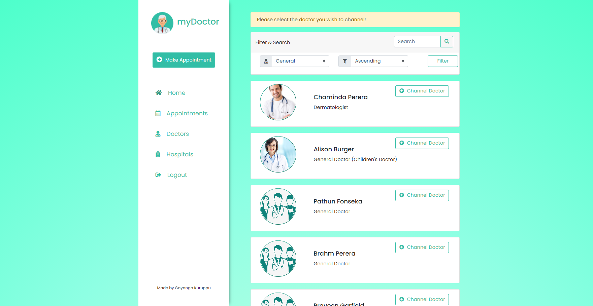

# myDoctor

`All rights for the source code and other related material are reserved`

e-Channelling system using Java Servlets

Uses a set of **design patterns** to solve repetitive programming problems

-Singleton
-Facade
-Factory
-Adapter
-Observer
-Template
-Stratergy
-Proxy

 

 
